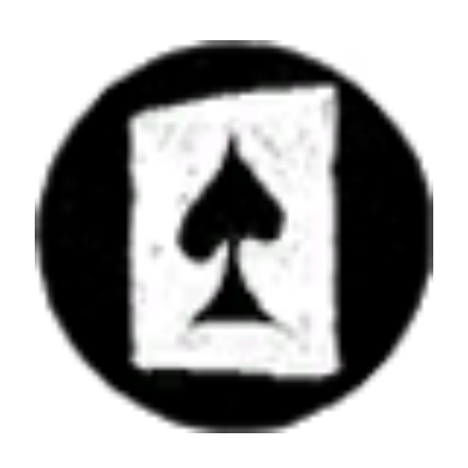
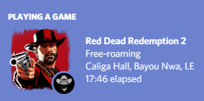
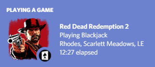
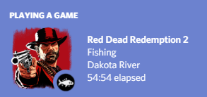
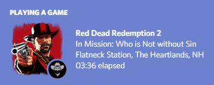

# Features

* Current location display

* Activity display *(optional)*

   | Activity name              | Icon                                                                                          |
   | -------------------------- | --------------------------------------------------------------------------------------------- |
   | Free-roaming               | -                                                                                             |
   | In a mission*              | -                                                                                             |
   | Fishing                    |              |
   | Playing Blackjack          |            |
   | Playing Poker              |                |
   | Playing Dominoes           |             |
   | Playing Five Finger Fillet |   |

   \* If `displayMissionName` option is set to `true`, activity name will be `In Mission: {MissionName}`.

* Honor display *(optional)*

   Shows your current honor as a small icon. If you have both activity display and honor display enabled, activity icon overrides honor icon when you're doing an activity.

* Elapsed time display

# Preview images

