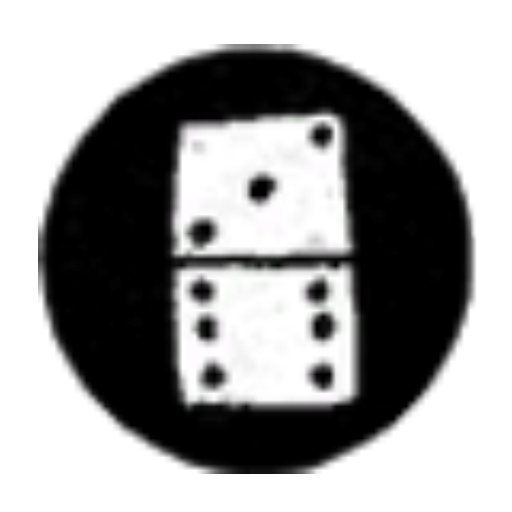

# Features

* Current location display

* Activity display *(optional)*

   | Activity name              | Icon                                                                                          |
   | -------------------------- | --------------------------------------------------------------------------------------------- |
   | Free-roaming               | -                                                                                             |
   | In a mission*              | -                                                                                             |
   | Fishing                    |              |
   | Playing Blackjack          |            |
   | Playing Poker              |                |
   | Playing Dominoes           |             |
   | Playing Five Finger Fillet |   |

   \* If `displayMissionName` option is set to `true`, activity name will be `In Mission: {MissionName}`.

* Honor display *(optional)*

   Shows your current honor as a small icon. If you have both activity display and honor display enabled, activity icon overrides honor icon when you're doing an activity.

   | Honor rank | Honor points | Icon                                                                    |
   | ---------- | ------------ | ----------------------------------------------------------------------- |
   | -8         | -320         |   |
   | -7         | -280         |   |
   | -6         | -240         |   |
   | -5         | -200         |   |
   | -4         | -160         |   |
   | -3         | -120         |   |
   | -2         | -80          |   |
   | -1         | -40          |   |
   | 0          | 0            |   |
   | 1          | 40           |   |
   | 2          | 80           |   |
   | 3          | 120          |  |
   | 4          | 160          |  |
   | 5          | 200          |  |
   | 6          | 240          |  |
   | 7          | 280          |  |
   | 8          | 320          |  |

* Elapsed time display *(optional)*

# Preview images

